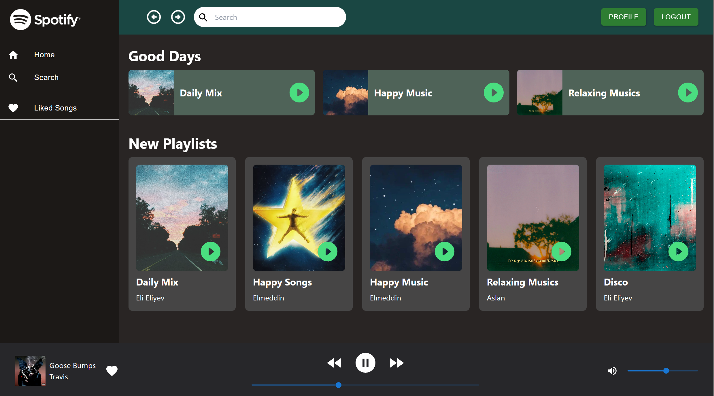
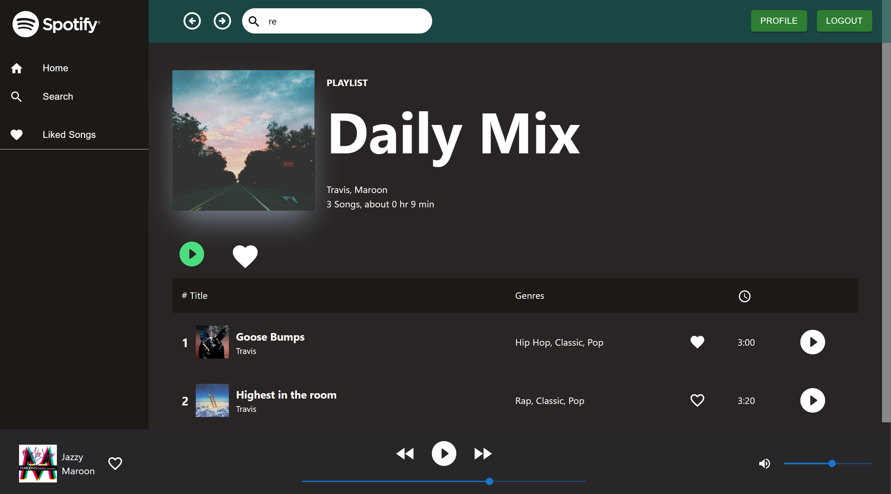
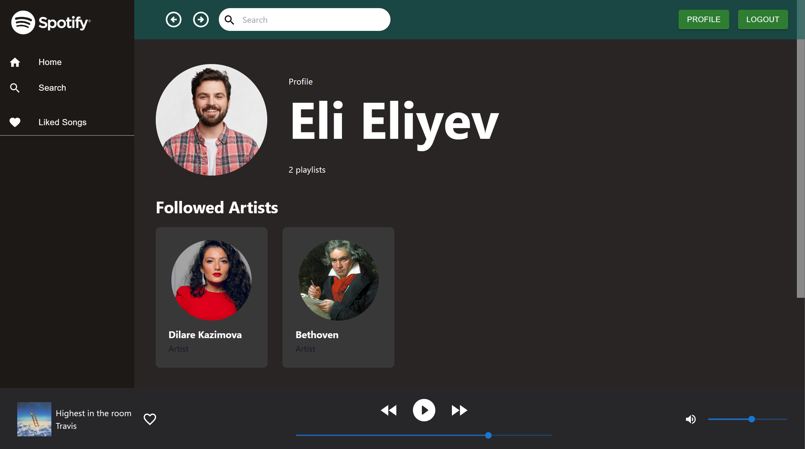
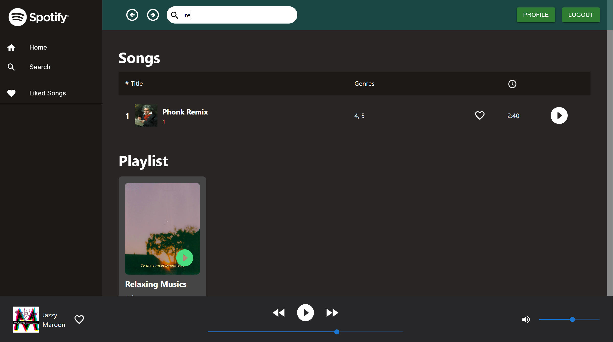
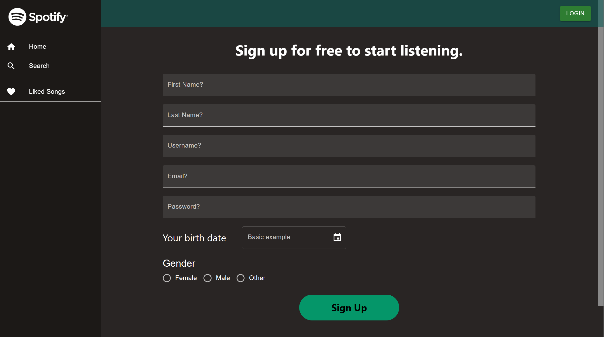
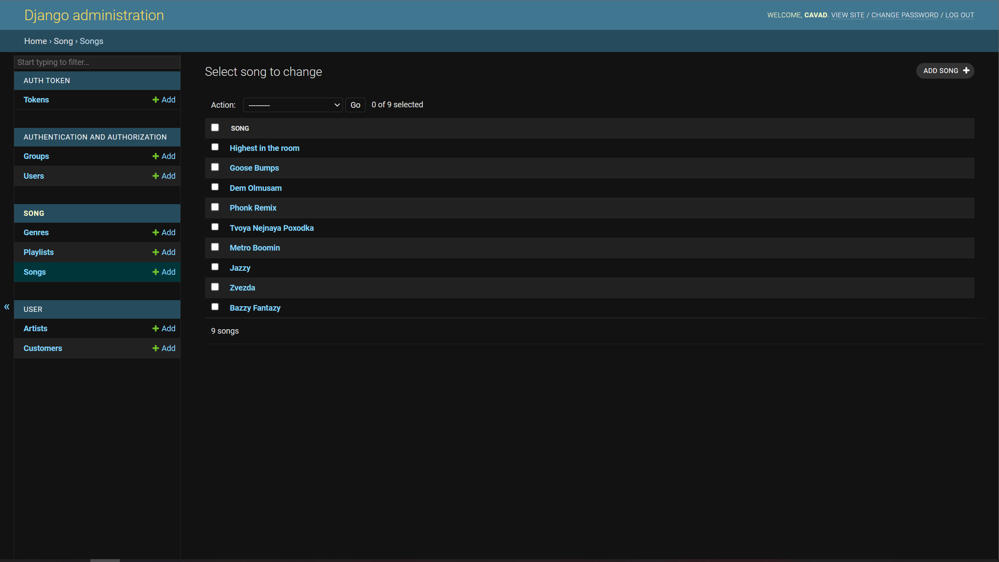
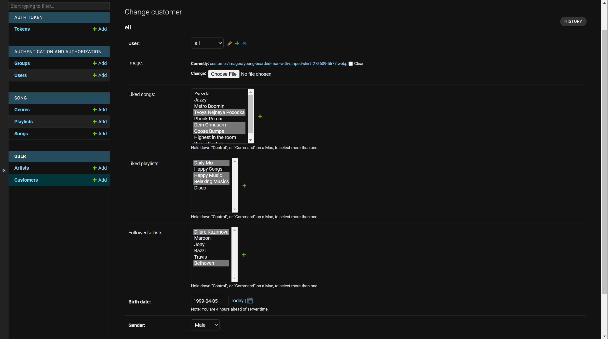
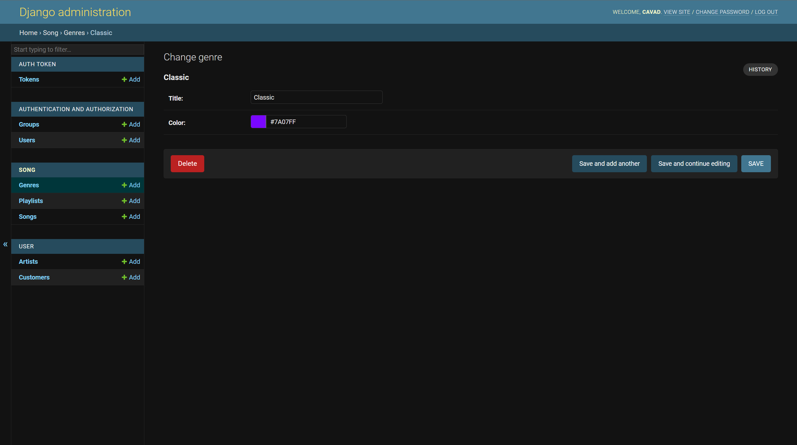

# 🎧 Spotify Clone with Django and React

## ⚙ Used Technologies:
- Django Rest Framework
- React
- Typescript
- TailwindCSS
- Redux Toolkit
- Material UI
- Docker

## 🛠 How to setup?
The easiest way to setup this project is using Docker. 

If you don't have Docker you can install it from [this link](https://www.docker.com/products/docker-desktop/).

After downloading Docker open terminal and go to directory of docker-compose.yml. 

After all just write `docker compose up` command. You will have to wait to build images and start the app for a while. When it ends you can open site from [http://localhost:3000](http://localhost:3000) address.

Also you can access to admin panel via this link: [http://localhost:8000/admin/](http://localhost:8000/admin/). Username and password is just `admin`.

## 📖 Documentation
All of the necessary algorithms have comment. On the other hand, there is Postman documentation available to follow necessary URLs and Responses. To access it, open the Postman application and import the `Spotify.postman_collection.json` file.

## 📷 Screenshots
### Home

### Playlist

### Profile

### Genres

### Search

### Login

### Register

### Admin Panel

### Admin Panel Customer

### Admin Panel Genre
